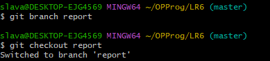

# LR6
Лабораторная работа №6

Цель лабораторной работы: изучение базовых возможностей системы управления версиями, опыт работы с Git API, опыт работы с локальным и удаленным репозиторием.

Выполнение работы

* Сделать fork репозитория на GitHub

* Клонировать свой личный удалённый репозиторий на компьютер.

* Добавить файл через интерфейс GitHub. Подтянуть изменения в локальный репозиторий.

*  Получить историю операций для каждой из веток.

* Просмотреть последние изменения. 

* Выполнить слияние в ветку master, разрешив конфликт.

* Удалить побочную ветку после успешного слияния.

* Сделать изменения и зафиксировать их, оставляя комментарии ,несколько раз. 

* Сделать откат коммита. 

* Создать ветку для отчёта.
